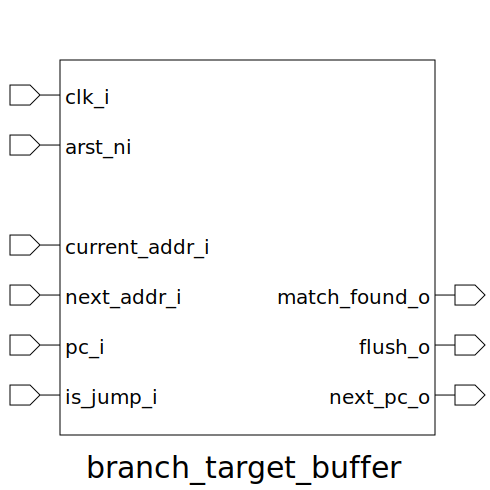

# branch_target_buffer (module)

### Author : Subhan Zawad Bihan (https://github.com/SubhanBihan)

## TOP IO

## Description

The `branch_target_buffer` is designed to store and manage branch target addresses for a processor,
helping to predict the next instruction address in case of a branch or jump.
 **This file is part of squared-studio:maverickOne**
 **Copyright (c) 2025 squared-studio**
 **Licensed under the MIT License**
 **See LICENSE file in the project root for full license information**

## Parameters
|Name|Type|Dimension|Default Value|Description|
|-|-|-|-|-|
|NUM_BTBL|int||maverickOne_pkg::NUM_BTBL|Number of branch target buffer lines|
|XLEN|int||maverickOne_pkg::XLEN|Integer register width|

## Ports
|Name|Direction|Type|Dimension|Description|
|-|-|-|-|-|
|clk_i|input|logic||Clock input|
|arst_ni|input|logic||Asynchronous reset input|
|current_addr_i|input|logic [XLEN-1:0]||Current address (EXEC) input|
|next_addr_i|input|logic [XLEN-1:0]||Next address (EXEC) input|
|pc_i|input|logic [XLEN-1:0]||Program counter (IF) input|
|is_jump_i|input|logic||Is jump/branch (IF) input|
|match_found_o|output|logic||Found match in buffer output|
|update_table_o|output|logic||Table update event output|
|next_pc_o|output|logic [XLEN-1:0]||Next program counter (in case of jump) output|
