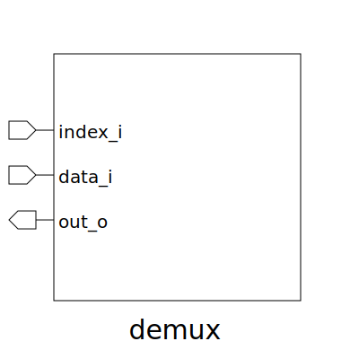

# demux (module)

### Author : Foez Ahmed (https://github.com/foez-ahmed)

## TOP IO

## Description

 **This file is part of DSInnovators:maverickOne**
 **Copyright (c) 2024 DSInnovators**
 **Licensed under the MIT License**
 **See LICENSE file in the project root for full license information**

## Parameters
|Name|Type|Dimension|Default Value|Description|
|-|-|-|-|-|
|NUM_ELEM|int||4|Number of elements in the demux|
|ELEM_WIDTH|int||1|Width of each element|

## Ports
|Name|Direction|Type|Dimension|Description|
|-|-|-|-|-|
|index_i|input|logic [$clog2(NUM_ELEM)-1:0]||Input index for selection|
|data_i|input|logic [ ELEM_WIDTH-1:0]||Input data to be demultiplexed|
|out_o|output|logic [ NUM_ELEM-1:0][ELEM_WIDTH-1:0]||Output array for demuxed data|
