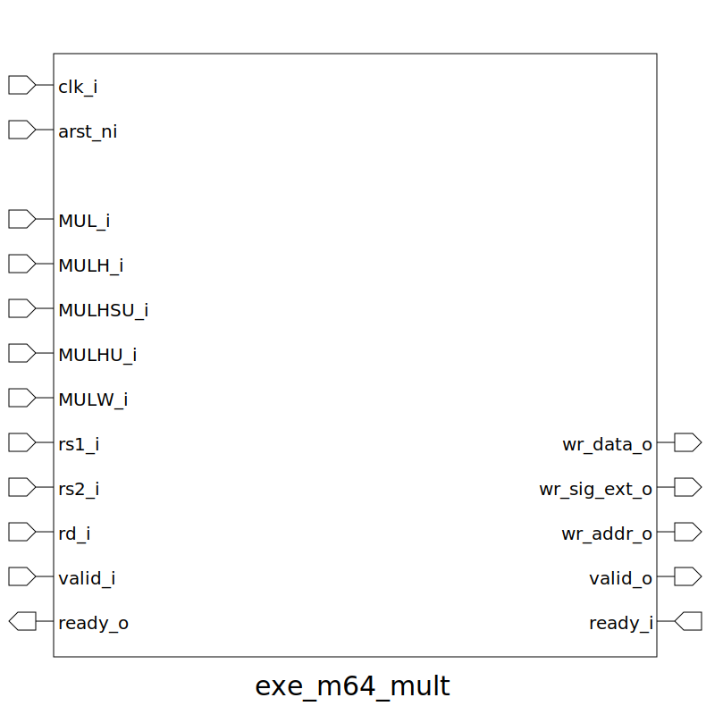

# exe_m64_mult (module)

### Author : Foez Ahmed (https://github.com/foez-ahmed)

## TOP IO

## Description

This module implements a 64-bit multiplier with support for various multiplication operations
including:
- **MUL:** Signed multiplication
- **MULH:** Signed high multiplication
- **MULHSU:** Signed-unsigned high multiplication
- **MULHU:** Unsigned high multiplication
- **MULW:** Word multiplication
 **This file is part of DSInnovators:maverickOne**
Copyright (c) 2024 DSInnovators
 **Licensed under the MIT License**
 **See LICENSE file in the project root for full license information**

## Parameters
|Name|Type|Dimension|Default Value|Description|
|-|-|-|-|-|

## Ports
|Name|Direction|Type|Dimension|Description|
|-|-|-|-|-|
|clk_i|input|logic||Clock input|
|arst_ni|input|logic||Asynchronous reset, active low|
|MUL_i|input|logic||Multiply operation signal|
|MULH_i|input|logic||Multiply high operation signal|
|MULHSU_i|input|logic||Multiply high signed-unsigned operation signal|
|MULHU_i|input|logic||Multiply high unsigned operation signal|
|MULW_i|input|logic||Multiply word operation signal|
|rs1_i|input|logic [63:0]||Source register 1 input|
|rs2_i|input|logic [63:0]||Source register 2 input|
|rd_i|input|logic [5:0]||Destination register input|
|valid_i|input|logic||Valid input signal|
|ready_o|output|logic||Ready output signal|
|wr_data_o|output|logic [63:0]||Write data output|
|wr_size_o|output|logic [ 1:0]||Write size output|
|wr_addr_o|output|logic [ 5:0]||Write address output|
|valid_o|output|logic||Valid output signal|
|ready_i|input|logic||Ready input signal|
