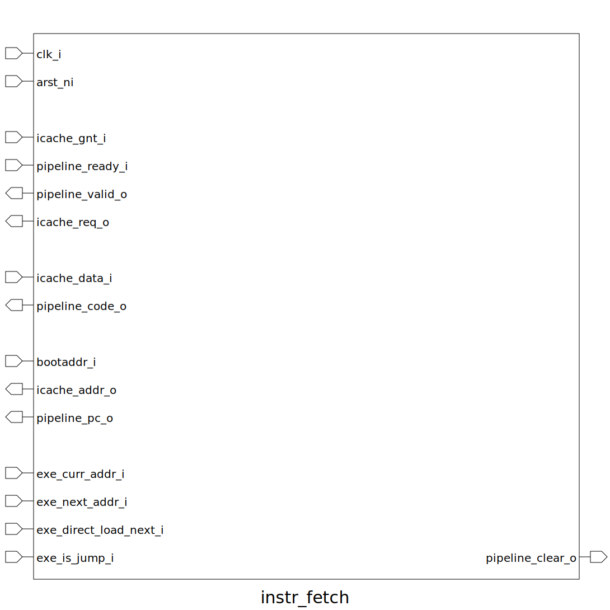

# instr_fetch (module)

### Author : Subhan Zawad Bihan (https://github.com/SubhanBihan)

## TOP IO

## Description

This SystemVerilog module, instr_fetch, is responsible for fetching instructions in a processor
pipeline. It interfaces with an instruction cache and the execution stage, managing the flow of
instruction data and addresses.
 **This file is part of squared-studio:maverickOne**
Copyright (c) 2024 squared-studio
 **Licensed under the MIT License**
 **See LICENSE file in the project root for full license information**

## Parameters
|Name|Type|Dimension|Default Value|Description|
|-|-|-|-|-|
|XLEN|int||maverickOne_pkg::XLEN|Integer register width|
|ILEN|int||maverickOne_pkg::ILEN|Instruction length|
|addr_t|type||logic [XLEN-1:0]|Address type|
|instr_t|type||logic [ILEN-1:0]|Instruction data type|

## Ports
|Name|Direction|Type|Dimension|Description|
|-|-|-|-|-|
|clk_i|input|logic||Clock input|
|arst_ni|input|logic||Asynchronous reset input|
|icache_gnt_i|input|logic||icache grant signal input|
|pipeline_ready_i|input|logic||pipeline ready signal input|
|pipeline_valid_o|output|logic||pipeline valid signal output|
|icache_req_o|output|logic||icache request signal output|
|icache_data_i|input|instr_t||Instruction (cache) data input|
|pipeline_code_o|output|instr_t||Pipeline code (instruction) output|
|bootaddr_i|input|addr_t||Boot address input|
|icache_addr_o|output|addr_t||Instruction cache address output|
|pipeline_pc_o|output|addr_t||Pipeline PC output|
|exe_curr_addr_i|input|addr_t||Current address (EXEC) input|
|exe_next_addr_i|input|addr_t||Next address (EXEC) input|
|exe_direct_load_next_i|input|logic||Is jump/branch (EXEC) input|
|exe_is_jump_i|input|logic||Is jump/branch (EXEC) input|
|pipeline_clear_o|output|logic||Pipeline clear signal output|
