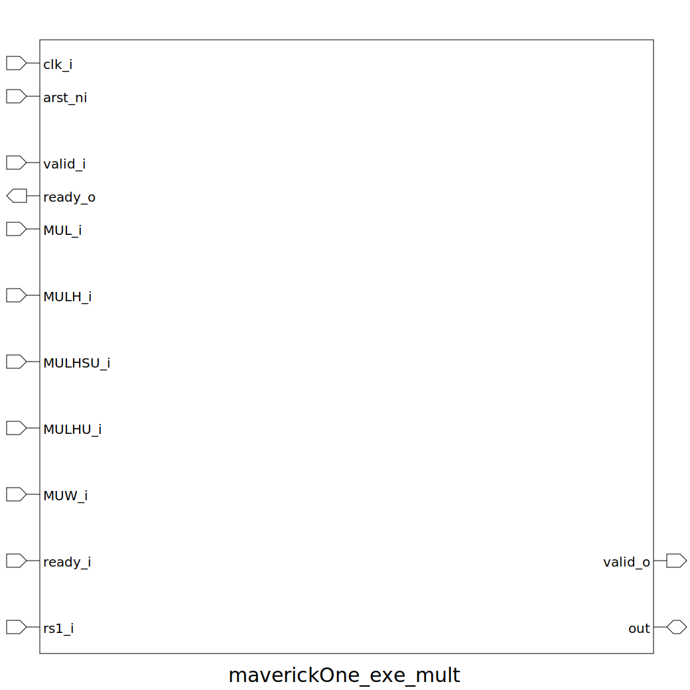

# maverickOne_exe_mult (module)

### Author : Foez Ahmed (https://github.com/foez-ahmed)

## TOP IO

## Description

Write a markdown documentation for this systemverilog module:
 **This file is part of DSInnovators:maverickOne**
 **Copyright (c) 2024 DSInnovators**
 **Licensed under the MIT License**
 **See LICENSE file in the project root for full license information**

## Parameters
|Name|Type|Dimension|Default Value|Description|
|-|-|-|-|-|
|XLEN|int||maverickOne_pkg::XLEN||

## Ports
|Name|Direction|Type|Dimension|Description|
|-|-|-|-|-|
|clk_i|input|logic|||
|arst_ni|input|logic|||
|valid_i|input|logic|||
|ready_o|output|logic|||
|MUL_i|input|logic|||
|MULH_i|input|logic|||
|MULHSU_i|input|logic|||
|MULHU_i|input|logic|||
|MUW_i|input|logic|||
|valid_o|output|logic|||
|ready_i|input|logic|||
|rs1_i|input|logic [XLEN-1:0]|||
|out|interface||putlogic[1023:0]out||
