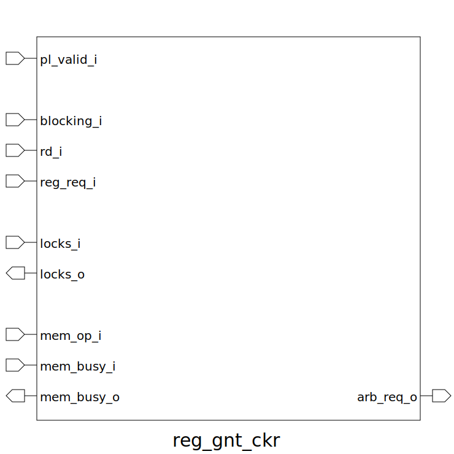

# reg_gnt_ckr (module)

### Author : Foez Ahmed (https://github.com/foez-ahmed)

## TOP IO

## Description

This module handles register locking and arbitration in a pipelined environment for a RISC-V core.
It ensures that necessary registers are locked/unlocked based on the current pipeline state and the
requirements of instructions being executed.
 **This file is part of squared-studio:maverickOne**
 **Copyright (c) 2025 squared-studio**
 **Licensed under the MIT License**
 **See LICENSE file in the project root for full license information**

## Parameters
|Name|Type|Dimension|Default Value|Description|
|-|-|-|-|-|
|NR|int||maverickOne_pkg::NUM_REGS|Number of registers|

## Ports
|Name|Direction|Type|Dimension|Description|
|-|-|-|-|-|
|pl_valid_i|input|logic|| Valid instruction signal from the pipeline.|
|blocking_i|input|logic|| Signal to lock all registers for blocking instructions.|
|rd_i|input|logic [$clog2(NR)-1:0]|| Index of the destination register.|
|reg_req_i|input|logic [ NR-1:0]|| Bitmask indicating required source registers for the current instruction.|
|locks_i|input|logic [NR-1:0]|| Input bitmask of locked registers.|
|locks_o|output|logic [NR-1:0]|| Output bitmask of locked registers. When blocking_i = 0, register 0 (rd_i = 0) can never be locked. Otherwise, lock the register indicated by rd_i.|
|mem_op_i|input|logic|| Flag indicating if the current operation is a memory operation.|
|mem_busy_i|input|logic|| Flag indicating if the memory is busy from the previous operation.|
|mem_busy_o|output|logic|| Flag indicating if the memory will be busy for the next operation.|
|arb_req_o|output|logic|| Request signal to the arbiter based on locks_i and required source registers. All required source registers must be unlocked to assert this signal.|
