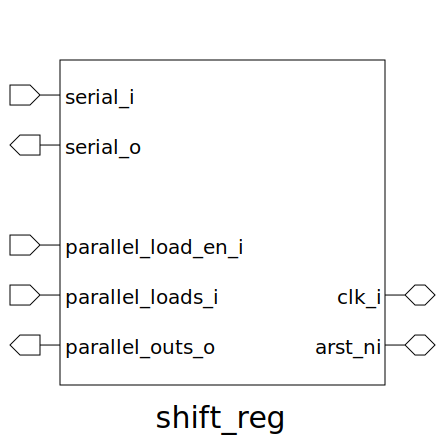

# shift_reg (module)

### Author : Subhan Zawad Bihan (https://github.com/SubhanBihan)

## TOP IO

## Description

Shift Register with both Serial and Parallel input-output functionality.
Parallel loading feature can be enabled/disabled by setting PARALLEL_LOAD_ENABLE.
 **This file is part of DSInnovators:maverickOne**
 **Copyright (c) 2024 DSInnovators**
 **Licensed under the MIT License**
 **See LICENSE file in the project root for full license information**

## Parameters
|Name|Type|Dimension|Default Value|Description|
|-|-|-|-|-|
|PARALLEL_LOAD_ENABLE|bit||1'b1|Enable for paprallel loading function|
|NUM_STAGES|int||4|Number of FF stages|
|DATA_WIDTH|int||8|Number of bits passing through the registers|
|data_t|type||logic [DATA_WIDTH-1:0]||

## Ports
|Name|Direction|Type|Dimension|Description|
|-|-|-|-|-|
|clk_i|interface|logic||Clock input|
|arst_ni|interface|logic||Asynchronous Reset input|
|serial_i|input|data_t||Serial Data input|
|serial_o|output|data_t||Serial Data Output|
|parallel_load_en_i|input|logic [NUM_STAGES-1:0]||Parallel Load/Write Enables input|
|parallel_loads_i|input|data_t [NUM_STAGES-1:0]||Parallel loads (values) input|
|parallel_outs_o|output|data_t [NUM_STAGES-1:0]||Parallel FF values output|
